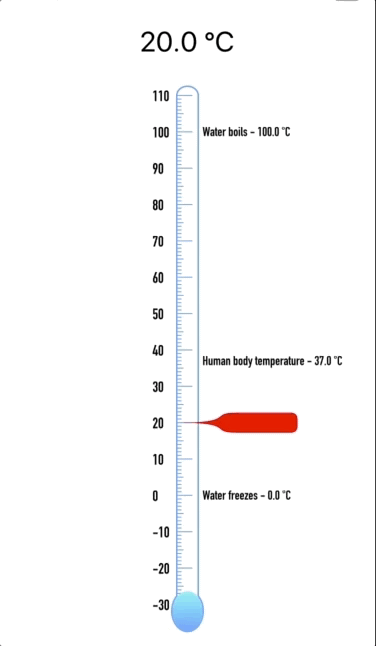

# ThermometerControl

`ThermometerControl` is a highly customizable `UIControl` for user input of temperature.



## How to use
Use it like a `UISlider`:

```swift
thermometerControl.addTarget(self, action: #selector(thermometerChanged), for: .valueChanged)
thermometerControl.isContinuous = true
thermometerControl.showsWaypoints = true // Shows standard waypoints such as freezing and boiling
```

### Customizable appearance and behavior
```swift
struct Defaults {
    static let lineWidth: CGFloat = 3.0
    static let gradientStart = UIColor(red:0.51, green:0.92, blue:0.95, alpha:1.0)
    static let gradientEnd = UIColor(red:0.39, green:0.64, blue:1.00, alpha:1.0)
    static let outlineColor: UIColor = Defaults.gradientEnd
    static let baseUnit: TemperatureUnit = .celsius
    static let maximumDegrees: Double = 110
    static let minimumDegrees: Double = -30
    static let degrees: Double = 27 // current reading
    static let hashMarkColor = Defaults.gradientEnd
    static let sliderColor = UIColor.red
    static let sliderSize = CGSize(width: 120, height: 40)
    static let isContinuous = false
    static let showsWaypoints = false
    static let fontName = "DINCondensed-Bold"
}
```
